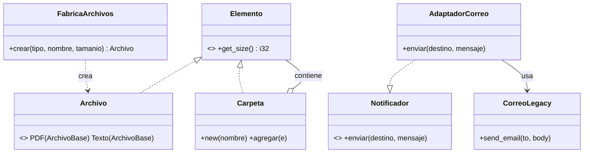

## Análisis del estado inicial del programa
1. El método agregarArchivo agrega archivos a carpetas.
  Para esto recibe un tipo de archivo, nombre, tamaño y carpeta, y decide qué tipo de archivo crear según el tipo, lo crea con el nombre y el tamaño, y posteriormente lo agrega a la carpeta.

2. El método obtenerTamanio calcula el tamaño total de una carpeta.
  Para esto recorre recursivamente todos los archivos y carpetas, y dependiendo del tipo de archivo, suma el tamaño.

3. El método enviarResultado se encarga de enviar el tamaño total de una carpeta por correo.


## Problemas identificados

- Varias funciones tienen que considerar cada caso de tipo de archivo
- Demasiado acoplamiento entre la función `enviar_resultados` y la interfaz de `CorreoLegacy` 
- Al manejar los archivos como un enum, hay poca extensibilidad si se quiere agregar nuevos tipos de archivo.


## Pruebas unitarias necesarias

- Carpeta vacia -> tamaño cero
- Carpeta con pdf de 120 -> tamaño 120
- Carpeta con pdf de 120 y texto de 80 -> tamaño 200
- Ejemplo con subcarpeta de 50 y tamaño total 250
- Carpeta con archivo de tamaño 0 -> tamaño 0


# Refactorización

## Patrón _Composite_
Usar el patrón _composite_ para tener una interfaz unificada para manejar archivos y carpetas.

Usar un _trait_ para abstraer los elementos del sistema de archivos y usar _trait objects_ para los argumentos en las funciones.

La función `obtener_tamanio` ahora es más natural que sea un método del _trait_.

## Patrón _Factory Method_

Usar el patrón _factory method_ para abstraer la creación de archivos, de esta forma desacoplando el manejo de casos para archivos pdf y txt.

Definiremos una estructura `FabricaArchivos` que implementa un método `crear` a donde delegaremos la decisión de qué tipo de archivo crear.


## Patrón _Adapter_

Usar el patrón _adapter_ para cambiar la interfaz que se usa en `main` para enviar correos, conservando la interfaz que expone `CorreoLegacy`.

Definiremos un nuevo trait `Notificador` para definir la interfaz buscada, y posteriormente basta encapsular un `CorreoLegacy` en una estructura `AdapatadorCorreo` que implementa `Notificador` e internamente usa `CorreoLegacy`.

La función `enviar_resultado` ahora recibe un `Notificador` como parámetro adicional, y en `main` se crea una instancia de `AdaptadorCorreo`.


# Análisis final

## Pruebas y salida esperada

| # | Entrada | Esperado | Obtenido |
|---|---------|----------|----------|
| 1 | Carpeta vacía | 0 | 0 |
| 2 | PDF de 120 | 120 | 120 |
| 3 | PDF 120 + TXT 80 | 200 | 200 |
| 4 | PDF 120 + TXT 80 + subcarpeta TXT 50 | 250 | 250 |
| 5 | PDF de 0 | 0 | 0 |

### Salida de `main`

```
250
Para: profesor@universidad.edu
Tamanio total: 250
```

El tamaño total y el correo simulado conservan los resultados originales.

## Esquema de la solución



En Rust no hay herencia de clases, por lo que el _Factory Method_ se implementa con una única estructura `FabricaArchivos` que decide el tipo con un `match` sobre el enum, en lugar de un `CreadorArchivo` abstracto con dos creadores concretos.
Esto es más idiomático: aprovecha el modelado con enums y evita crear jerarquías y _trait objects_ de fábricas que no aportan demasiado cuando los tipos son fijos.

## Responsabilidades

Después de la refactorización, las responsabilidades de cada estructura y _trait_ quedaron como sigue:

- `Elemento`: define la interfaz común (`get_size`); antes esa lógica estaba dispersa en `obtenerTamanio`.
- `Archivo` / `ArchivoBase`: cada archivo conoce su propio tamaño; ya no hay un `switch` externo por tipo.
- `Carpeta`: acumula y delega el cálculo a sus hijos recursivamente (_Composite_); antes lo hacía `obtenerTamanio`.
- `FabricaArchivos`: concentra la decisión de qué tipo crear; antes estaba dentro de `agregarArchivo`.
- `Notificador`: abstrae el mecanismo de aviso; `enviarResultado` deja de depender de `CorreoLegacy`.
- `AdaptadorCorreo`: traduce `enviar` a `send_email`, aislando la interfaz heredada.
- `CorreoLegacy`: permanece intacto y conserva su responsabilidad de envío.

## Lo que no cambió

- La salida observable: tamaño total `250` y el mismo correo simulado.
- El flujo de uso (crear carpetas, agregar archivos por tipo/nombre/tamaño, obtener tamaño, enviar resultado).
- Las cinco pruebas de la etapa 2 siguen pasando sin cambios.
